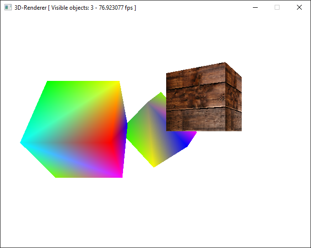

# 3D-Renderer

## Description

Project for the course Advanced Algorithms and Programming Methods 2

## Compiling

This project makes use of CMake, defaulted to Release mode.

### Windows

1. Follow instructions in `include` to set up the SDL library
2. Generate build files using CMake
3. Compile the program
4. Copy `SDL2.dll` from `include/SDL2-*/lib/x64` to the build folder
5. Copy `texture.bmp` from `textures` to the build folder

### Linux
1. Make sure the package `libsdl2-dev` (Ubuntu) or equivalent is installed
2. Generate build file with `cmake` command
3. Compile the program using `make`
4. Copy `texture.bmp` from `textures` to the build folder

## Usage

Two executables will be compiled:
- `3D_Renderer` outputs a scene on the terminal
- `3D_Renderer_SDL` outputs a scene on a window created by SDL

## Requirements list:

### Assignment 1

Implement a software 3D rendering pipeline with programmable fragment shader.

Assume the pipeline receives triangles already in view coordinates, project them, rasterize the triangle, interpolate the vertex attributes, and for each fragment pass the interpolated vertex to the fragment shader.

Render to a software target, a continuous region of memory (e.g. array or vector) of a parametric type target_t which holds the rendered image in row-major format and can be used to display or save the rendered image. The pipeline must be agnostic with respect to type (target_t) and dimensions of the target. The fragment shader, when producing a fragment, must provide a target_t.

Implement the shader in terms of a strategy pattern, i.e., a call to a polymorphic funcion in a class held by the pipeline, but hot-swappable.

Assume a single known vertex definition with pre-specified attributes (3D coordinates, 3D normals and u,v coordinates) known by the polymorphic interface.

### Assignment 2

Complete the pipeline:

- add management of objects, their properties (i.e., textures), and the shaders to be applied to those objects;
- transform the dynamically polymorphic call to the shader into a static one;
- allow for generic vertex information, i.e., the combination of object-shader determines the data flow from rasterizer and shader, and should not be a pre-determined property of the rasterizer as was in the previous assignment (i.e., the Vertex struct in my solution).

Try and apply a data-oriented design to the full pipeline.

### Final project

- Visibility culling: the object keeps its bounding box and the system verifies its visibility before passing it to the pipeline
- Transformations and animations: each object exposes its transformations for the physics engine and can contain multiple meshes for animations. The physics engine (not to be implemented, but consider its interation with the pipeline) can then change mesh and position of the object according to the logic of the program.
