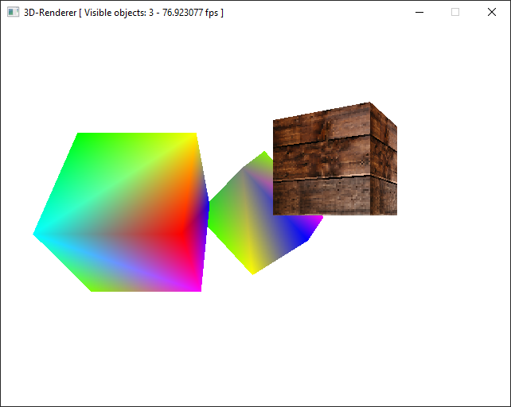

# 1. Introduction

This project was developed for the course *Advanced Algorithms and Programming Methods 2*.

Read the file `README.md` for informations about the project requirements and how to compile it.

The project is hosted at [https://github.com/GobboJ/3D-Renderer](https://github.com/GobboJ/3D-Renderer).
  
# 2. Project Structure

The project is split in two folders, `src/main` and `src/pipeline`, which contain respectively the "frontend" that outputs the image, and the "backend" that does the rendering job.

## 2.1. The `main` folder

Two main files are provided, `main.cpp` and `main_gui.cpp`, thus two executables will be produced. In the first case, the code will generate an example scene and render a single frame on a terminal window, while the second will use the SDL2 library to create a window where it will output the same scene, but colored and animated.

The example scene is generated by the `SampleScene` class. This class is templated on the type of the target, two shaders which will be applied to the objects, and textures. The scene consists of 3 objects and a camera:

- A cube with two meshes (i.e. two animation steps) made of `SimpleVertex` vertices, to which the generic `FirstShader` is applied to;
- Another cube scaled to be a parallelepiped, with only one mesh, also using `SimpleVertex` vertices and `FirstShader`;
- Yet another cube, with a mesh of `TextureVertex` vertices and generic `SecondShader` shader. A texture will be applied to this object.

The console program will generate the scene as:
```cpp
myTexture t; // Fake empty texture, not used by CharShader
SampleScene<char, CharShader, CharShader, myTexture> sampleScene(t);
```
therefore applying `CharShader` to every object. Meanwhile, the SDL version will generate it as:
```cpp
myTexture t; // Code reading the texture from file omitted
SampleScene<Uint32, ColorShader, TextureShader, myTexture> sampleScene(t);
```
so it will apply `ColorShader` to the first two object, and `TextureShader` to the last one. These shaders are defined in the `Shaders.h` file.

The SDL executable will also transform the objects at every frame. In this example, two of the objects will rotate on a single axis while staying in position, while another object will move to the right, exiting the camera field of view. After this happens, one of the two visible object will transform by changing its mesh.

Both the main files will define a target, a region of memory the scene is rendered to. The memory address of the target is then passed to the constructor of the `Pipeline` class, along with its dimensions. Then, the scene `sampleScene.getScene()` is passed to the `render` method of the pipeline. Specifically, the console version will execute:
```cpp
char target[WIDTH * HEIGHT];
Pipeline<char> p(target, WIDTH, HEIGHT);
p.render(sampleScene.getScene());
```
while the SDL version will execute:
```cpp
Uint32 *colorTarget = new Uint32[WIDTH * HEIGHT];
Pipeline<Uint32> p(colorTarget, WIDTH, HEIGHT);
while(!exit) {
    // Update the scene
    int rendered_objects = p.render(sampleScene.getScene());
    // ...
}
```

## 2.2. The `pipeline` folder

As seen in the examples before, the `Pipeline` class is templated on the type of the target, and its constructor takes the memory address of the target and its width and height. The constructor will save those informations and generate a **Z-Buffer** with the same dimensions as the target. The `Pipeline` also defines the `render` method, which takes an object of type `Scene<target_t>` and calls its homonym `render` method, passing the target, z-buffer, width and height. The z-buffer is reset after the call.

A `Scene`, templated on the type of target, is constructed by passing a `Camera`. This class offers the `add` method which is in turn templated on the type of mesh, vertex, shader and textures, and takes as a parameter an `Object` with the mentioned template parameters. The method will extract the object's fields and pass them to the `std::make_unique` function, as such:

```cpp
std::vector<std::unique_ptr<DedicatedPipeline<target_t>>> pipelines;
// ...
template<class Mesh, class Vertex, class Shader, class ...Texture>
void add(const Object<Mesh, Vertex, Shader, Texture...> &o) {
    pipelines.push_back(
        std::make_unique<DedicatedPipelineImpl<target_t, Mesh, 
        Vertex, Shader, Texture...>>(o.getMeshes(), o.getShader(), 
            o.getTextures(), o.getBoundingSpheres(), o.getInfo()));
}
```

The `std::make_unique` function will create an object of type `DedicatedPipelineImpl` with the template and function parameters specified, encapsulating it inside a `std::unique_ptr` smart pointer, which will be added to the vector of pipelines with template parameter `std::unique_ptr<DedicatedPipeline<target_t>>`. The details of `DedicatedPipeline` and `DedicatedPipelineImpl` will be discussed later.

As mentioned earlier, the `render` method of `Scene` takes the target, z-buffer, width and heigth as parameters. The method will use these informations along with the `Camera` object held in `Scene` to build the **projection** and **viewport** matrices. Then, for each dedicated pipeline held in the vector, it will call its `render` method, passing the target, z-buffer, width, height, the **view** matrix held by the `Camera` object and the other two matrices generated earlier.

The `DedicatedPipeline` class is templated only on the target. It's purpose is to act as a base class, providing only a *virtual* method `render`. This allows to hold objects that differ in the template parameters in the same vector.

The `DedidatedPipelineImpl` class, templated on target, mesh, vertex, shader and textures, thus extends the base `DedicatedPipeline` class. Its constructor expects the data extracted from an `Object`, meaning the vector of meshes, the shader to be applied, the textures, the vector of bounding spheres and the object's metadata `ObjectInfo` (e.g. position, rotation, current frame, ...). The overrode method `render` is where finally the object is rendered to the target: as said earlier, it takes as parameters the target, z-buffer, width, height and the three matrices, **view**, **projection** and **viewport**.

The `render` function proceeds as follows:

1. Computes the **combined** matrix by multiplying first the **model** matrix, which is obtained from the `ObjectInfo`'s function `getModelMatrix()`, with the **view** matrix, and then the resulting matrix with the **projection** one;
1. The planes of the view frustum are extracted from the **combined** matrix;
1. Computes the signed distance between each plane and the center of the bounding sphere of the mesh of the current animation frame;
1. Compares these distances with the radius of the bounding sphere. If the bounding sphere is completely outside the view frustum, the object is culled and the function returns false, meaning that the object was not rendered;
1. Else, the object enters the pipeline and each triangle of its current mesh is iterated;
1. For each triangle, applies the **combined** transformation matrix to the three vertices that make up the triangle, obtaining also three **w** values, which will be used later; 
1. Again, the **viewport** matrix is applied to each vertex, transforming them in screen space;
1. The bounding box for the triangle is computed;
1. The `box_rasterizer` function is called, passing the target, z-buffer, width, height, the triangle, the three  **w** values and the bounding box.

The rasterizer will then perform these actions for each pixel inside the bounding box:

1. Computes the barycentric coordinates of the pixel according to the vertices of the triangle;
1. Verifies that the pixel lies inside the triangle. If it doesn't, it skips to the next pixel;
1. Computes the **z** value and tests it against the z-buffer to verify if that point of the triangle is occluded by another triangle;
1. If the point is not occluded, it computes the interpolated vertex by calling the `interpolate` function of the generic `Vertex` class, passing the three vertices, the barycentric coordinates and the **w** values. The implementation of `interpolate` varies based on what actual `Vertex` class is used;
1. The generic `Shader` is invoked, passing the interpolated vertex and the eventual textures, and the result is written on the target;
1. The Z-Buffer is updated with the new value.

An alternative, more efficient *scanline* based rasterization algorithm was implemented but it was producing some graphical artifacts on some edge cases, so it was commented out.

Two example `Vertex` classes are provided: `SimpleVertex`, which is defined by its position and a color, and `TextureVertex`, which is defined by its position and the **uv** coordinates, that specify the position in a texture where to sample the color. Each of these classes provide its own code to transform the vertex with a transformation matrix and to interpolate its attributes. Usually, the **w** values are used to perform *perspective correction* on the attributes.

Next will be described some classes that were not explained earlier.

### 2.2.1 `Camera`

The  `Camera` is created by passing to its constructor the vertical field of view, the near and far planes, position, the target position to be looking at and the up vector. This constructor will generate what is known as a **Look-at** camera, and will generate the **view** matrix accordingly. It could be also possible to write other constructors for other types of cameras, such as an **FPS** camera.

### 2.2.2 `Object`

The `Object` class is templated on the type of mesh, vertex, shader and textures. It is constructed by passing a vector of meshes, a shader and textures. The constructor will take care to generate a **bounding sphere** for each mesh of the object. To do this, for each mesh it iterates on every pair of vertices of the mesh, until the pair with the maximum distance between each vertex is found. At this point, the center of the bounding sphere is computed as the middle point of the line between those two vertices, and the radius as half of the distance.

### 2.2.3 `ObjectInfo`

The metadata of an object is kept inside an `ObjectInfo` instance. These informations include position, rotation, scaling, current animation frame, total number of frames and most importantly the **model** matrix. This class exposes methods to transform the object by modifying its position, rotation, scaling and current animation frame. Every time one of these is modified (except animation frame), the model matrix is computed again.

### 2.2.4 `Vertex3`

This class represents a three dimensional vector with all its operations, such as *dot* product, *cross* product, *scalar* product, *norm*, sum, division, multiplication.

# 3. Screenshots


